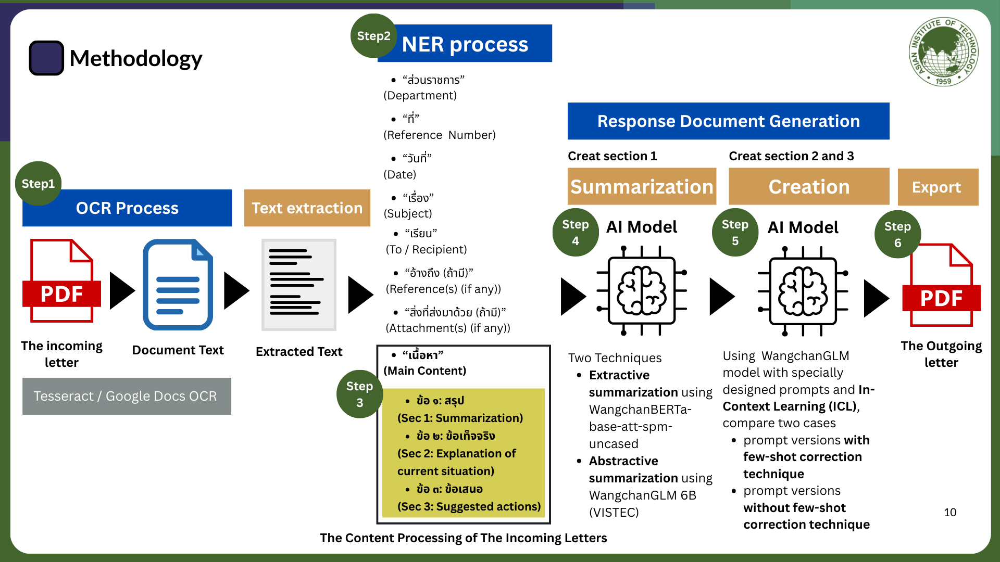

# Government Document Creation System

## 📌 Project Overview
This project is an **AI-powered Government Document Creation System** designed to automate the processing and generation of **official Thai government documents ("หนังสือราชการ")**. It leverages **OCR, Named Entity Recognition (NER), Summarization, and AI-driven Text Formalization** to transform **unstructured text into structured, formal Thai documents**.

This system automatically generates a formal **Outgoing Letter ("หนังสือตอบกลับ")** from a scanned **Incoming Letter ("หนังสือรับ")** PDF.  It leverages a combination of:
- **Tesseract OCR** for text extraction
- **Rule-based NER** for section detection
- **Custom Tokenizer** for specialized tokens (5W1H)
- **WangchanGLM** for summarization and content generation
- **Streamlit** for an interactive user interface

## 🛠️ System Workflow
1. **Upload Incoming Letter (PDF)**  
   ⮕ OCR text extraction + pre-processing (denoising, adaptive threshold)

2. **Text Correction & Section Extraction**  
   ⮕ Rule-based extraction (e.g., "ส่วนราชการ", "ที่", "วันที่", "เรื่อง", "เรียน", "อ้างถึง", "สิ่งที่ส่งมาด้วย")

3. **Edit and Confirm Sections**  
   ⮕ Manual correction allowed + Saving to database

4. **Create Outgoing Letter**  
   - Section 1 (Summary): Generate multiple versions using LLM with various temperatures, select the best one using **Cosine Similarity**
   - Section 2 (Fact Expansion): Generate based on Section 1
   - Section 3 (Command/Consideration): Generate using instruction-based prompting, with and without feedback example

5. **Preview and Export**  
   ⮕ Export the completed Outgoing Letter as a DOCX file.
## 📜 System Workflow


## ⚙️ Installation
```bash
# Clone this repository
git clone https://github.com/PK-124960/NLP-Project_Jan25.git
cd NLP-Project_Jan25

# Create a virtual environment
python -m venv venv
source venv/bin/activate  # On Windows use: venv\Scripts\activate

# Install dependencies
pip install -r requirements.txt
```

## 🛠️ Usage
```bash
# Run the OCR and Named Entity Recognition pipeline
python src/ocr_pipeline.py --input input_docs/sample.pdf --output output_text.json

# Run Summarization Model
python src/summarization.py --input output_text.json --output summarized_text.json

# Run Formal Thai Text Processing
python src/text_formalization.py --input summarized_text.json --output formalized_text.json

# Generate Final Document
python src/document_generator.py --input formalized_text.json --output final_document.docx
```

## 📊 Dataset & Preprocessing
- **Government Document Dataset (Thai OCR: DLA Document)** → Used for training OCR and NER models.
- **OCR Processing Data** → Contains raw OCR text and corrected outputs.
- **Summarization Dataset (Thai Wikipedia Summarization + Fine-Tuned AI Data)**.
- **Formal Thai Language Dataset (Lexitron 2.0 + Manually Collected Phrases)**.

---

## 🧪 Experiments Conducted

### Experiment 1: Section 1 Summarization

**Goal:**  
Generate a concise, formal summary from the main content of the Incoming Letter.

**Method:**
- Abstractive summarization using WangchanGLM
- Generated 5 versions (temperature = 0.1–0.5)
- Selected best version based on **Cosine Similarity**

**Evaluation Metrics:**  
- ROUGE-L
- BLEU Score
- Cosine Similarity

**Results:**
- **Extractive Summarization Average Metrics** (from Excel results):
  - ROUGE-L F1 ≈ Moderate (e.g., 0.25–0.85 depending on sample)
  - BLEU ≈ Low–Moderate
  - Cosine Similarity ≈ 0.58–0.93
- **Abstractive Summarization Average Metrics**:
  - ROUGE-L F1 ≈ 0.55–0.92
  - BLEU ≈ 0.01–0.37
  - Cosine Similarity ≈ 0.64–0.83

**Conclusion:**
- Abstractive summaries from WangchanGLM generally achieved **higher ROUGE-L** and **better semantic similarity** than pure extractive summaries.

---

### Experiment 2: Section 2 and 3 Generation

**Goal:**  
Expand factual information and generate actionable commands from Section 1.

**Method:**
- Fact expansion using prompt-based generation.
- Command generation (Section 3) with and without Feedback Examples.

**Evaluation Metrics:**  
- ROUGE-L F1
- BLEU Score
- Cosine Similarity

✅ **Section 3 (With Feedback Correction):**
- Cosine Similarity: **0.8244**
- BLEU Score: **0.3726**
- ROUGE-L F1: **0.9333**

✅ **Section 3 (Without Feedback Correction):**
- Cosine Similarity: **0.5566**
- BLEU Score: **0.0110**
- ROUGE-L F1: **0.8571**

**Conclusion:**
- **Using feedback examples greatly improves** the quality of Section 3 (higher BLEU, ROUGE-L, and Cosine Similarity).
- Without feedback, generation tends to drift from formal tone and introduce hallucinated content.

---

## 📦 Technology Stack

| Area | Tools |
|:----|:------|
| OCR | Tesseract OCR + OpenCV |
| NLP | HuggingFace Transformers, WangchanGLM, SentenceTransformers |
| Data Processing | pandas, regex, PyThaiNLP |
| Web App | Streamlit |
| Evaluation | Cosine Similarity, ROUGE, BLEU |

---

## 🚀 Key Features

- 🎯 High-accuracy OCR text extraction from scanned PDFs
- 🛠️ Editable and customizable extracted sections
- 🧠 LLM-based formal letter generation (Section 1, 2, 3)
- 📈 Automatic evaluation and selection of best summarization
- 📄 Ready-to-export DOCX format for official use
- 🌿 Earth-tone UI Theme (user-friendly design)

---

**Results:**
## 👥 Contributors
- **Team Member 1** - Ponkrit Kaewsawee
- **Team Member 2** - Voravit Chaiaroon 
- **Team Member 3** - Tada Suttake 
- **Team Member 4** - Arunya Prasantha Senadeera Senadiri Dumunnage

## 📄 License
This project is licensed under the MIT License. See the [LICENSE](LICENSE) file for details.

---
📢 **For any issues, feel free to open an issue on GitHub!** 🚀
