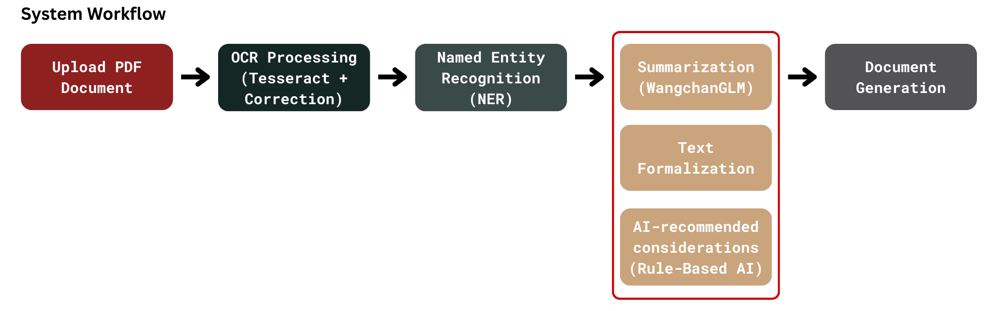

# Government Document Creation System

## 📌 Project Overview
This project is an **AI-powered Government Document Creation System** designed to automate the processing and generation of **official Thai government documents ("หนังสือราชการ")**. It leverages **OCR, Named Entity Recognition (NER), Summarization, and AI-driven Text Formalization** to transform **unstructured text into structured, formal Thai documents**.

## 🚀 Features
✅ **OCR Processing (Tesseract + Rule-Based Correction)** → Extracts text from scanned documents.  
✅ **Named Entity Recognition (NER) (Rule-Based + Dictionary Matching)** → Identifies key elements in documents (e.g., "ที่", "วันที่", "เรื่อง").  
✅ **Summarization (WangchanGLM + AI Post-processing)** → Condenses long text while retaining key information.  
✅ **Formal Thai Text Transformation (Fine-tuned Thai LLM + Rule-Based Adjustments)** → Converts informal text into proper Thai government writing.  
✅ **Document Generation & Exporting (DOCX/PDF)** → Generates official "หนังสือส่ง" (Outgoing Letters) from extracted content.  

## 📜 System Workflow


```mermaid
graph TD;
    A[Upload PDF Document] -->|Tesseract OCR| B(Extracted Text)
    B -->|Rule-Based OCR Correction| C(Cleaned Text)
    C -->|NER Processing| D(Extracted Entities)
    D -->|Summarization Model| E(Summarized Content)
    E -->|Text Formalization| F(Formalized Government Document)
    F -->|DOCX/PDF Export| G[Final "หนังสือส่ง"]
```

## ⚙️ Installation
```bash
# Clone this repository
git clone https://github.com/PK-124960/NLP-Project_Jan25.git
cd NLP-Project_Jan25

# Create a virtual environment
python -m venv venv
source venv/bin/activate  # On Windows use: venv\Scripts\activate

# Install dependencies
pip install -r requirements.txt
```

## 🛠️ Usage
```bash
# Run the OCR and Named Entity Recognition pipeline
python src/ocr_pipeline.py --input input_docs/sample.pdf --output output_text.json

# Run Summarization Model
python src/summarization.py --input output_text.json --output summarized_text.json

# Run Formal Thai Text Processing
python src/text_formalization.py --input summarized_text.json --output formalized_text.json

# Generate Final Document
python src/document_generator.py --input formalized_text.json --output final_document.docx
```

## 📊 Dataset & Preprocessing
- **Government Document Dataset (Thai OCR: DLA Document)** → Used for training OCR and NER models.
- **OCR Processing Data** → Contains raw OCR text and corrected outputs.
- **Summarization Dataset (Thai Wikipedia Summarization + Fine-Tuned AI Data)**.
- **Formal Thai Language Dataset (Lexitron 2.0 + Manually Collected Phrases)**.

## 🔥 Model Training & Evaluation
### OCR Processing Evaluation
**Metrics:** Character Error Rate (CER), Word Error Rate (WER)  
**Expected Results:** Lower CER and WER indicate improved OCR accuracy.  

### Named Entity Recognition (NER) Evaluation
**Metrics:** Precision, Recall, F1-score  
**Expected Results:** High F1-score (>85%) ensures accurate entity extraction.  

### Summarization Evaluation
**Metrics:** BLEU Score, ROUGE Score  
**Expected Results:** BLEU > 30%, ROUGE > 50% ensures summaries retain key information.  

### Formal Thai Text Evaluation
**Metrics:** Human Evaluation (Score 1-5)  
**Expected Results:** Avg. Score > 4.0 ensures high-quality formal Thai text.  

## 🧪 Experiment Details
To validate the effectiveness of the proposed approach, the following experiments were conducted:

### **1. OCR Performance Analysis**
- **Objective:** Assess the impact of Rule-Based OCR Correction on OCR accuracy.
- **Methodology:**
  - Apply **Tesseract OCR** on sample government documents.
  - Compare **raw OCR output vs. corrected output** (using Rule-Based Corrections).
  - Evaluate performance using **Character Error Rate (CER) and Word Error Rate (WER)**.
- **Results:**
  - Expected to achieve **CER < 10%** after correction.

### **2. NER Extraction Performance**
- **Objective:** Measure accuracy of Named Entity Recognition (NER) on structured government data.
- **Methodology:**
  - Run **Rule-Based NER model** on annotated datasets.
  - Evaluate using **Precision, Recall, and F1-score**.
- **Results:**
  - Expected **F1-score > 85%**.

### **3. Summarization Evaluation**
- **Objective:** Assess WangchanGLM’s ability to summarize government documents.
- **Methodology:**
  - Train summarization model using **Thai Wikipedia Summarization Dataset**.
  - Compare AI-generated summaries to human-written summaries.
  - Evaluate using **BLEU Score and ROUGE Score**.
- **Results:**
  - Expected **BLEU > 30%, ROUGE > 50%**.

### **4. Formal Thai Text Quality Assessment**
- **Objective:** Ensure AI-generated text follows official Thai writing standards.
- **Methodology:**
  - Apply **Fine-Tuned Thai LLM** to transform informal text into formal text.
  - Evaluate with **human scoring (1-5 scale) on Grammatical Accuracy, Contextual Appropriateness, and Naturalness**.
- **Results:**
  - Expected **Average Score > 4.0**.

## 🏆 Results
| **Module** | **Metrics Used** | **Expected Score** |
|------------|------------------|------------------|
| **OCR Processing** | Character Error Rate (CER), Word Error Rate (WER) | CER < 10% |
| **NER Extraction** | Precision, Recall, F1-score | F1-score > 85% |
| **Summarization** | BLEU Score, ROUGE Score | BLEU > 30%, ROUGE > 50% |
| **Formal Thai Text** | Human Evaluation (Score 1-5) | Avg. Score > 4.0 |

## 👥 Contributors
- **Team Member 1** - Ponkrit Kaewsawee
- **Team Member 2** - Voravit Chaiaroon 
- **Team Member 3** - Tada Suttake 
- **Team Member 4** - Arunya Prasantha Senadeera Senadiri Dumunnage

## 📄 License
This project is licensed under the MIT License. See the [LICENSE](LICENSE) file for details.

---
📢 **For any issues, feel free to open an issue on GitHub!** 🚀
